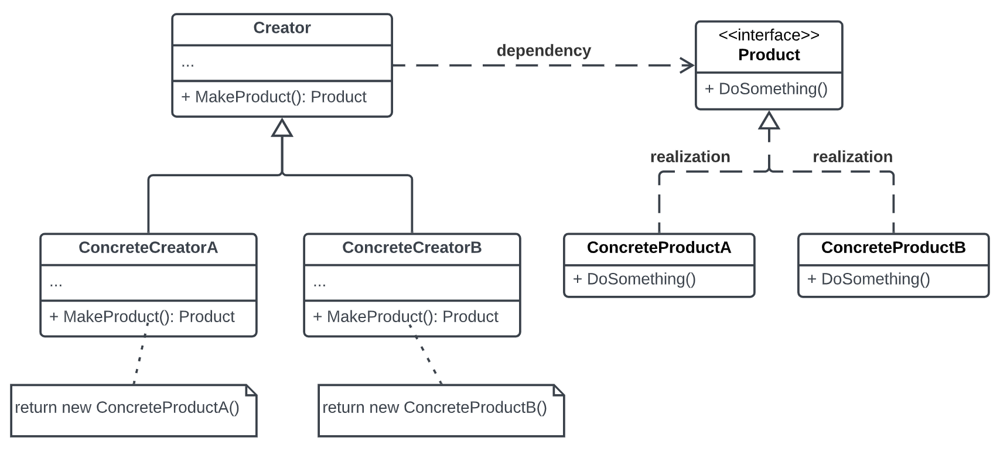

https://www.pentalog.com/blog/design-patterns/factory-method-design-pattern/

In object-oriented programming, the Factory Method is a Creational Design Pattern that allows us to create objects without specifying the exact class that will be instantiated. Instead of creating objects directly, we use a factory method to create and return them.

This Design Pattern promotes code reuse and loose coupling between classes making our code more modular and easier to maintain. It enables us to create objects without knowing the implementation details of our classes.

### How does the Factory Method creational pattern work?
The Factory Method pattern consists of four main components:

1. Product
2. Concrete Product(s)
3. Creator
4. Concrete Creator(s)

The Product is the interface or abstract class that defines the methods that the ConcreteProduct must implement. The ConcreteProduct is the class that implements the Product interface. The Creator is the abstract class that declares the Factory Method. The ConcreteCreator is the class that implements the Factory Method and returns the ConcreteProduct.

